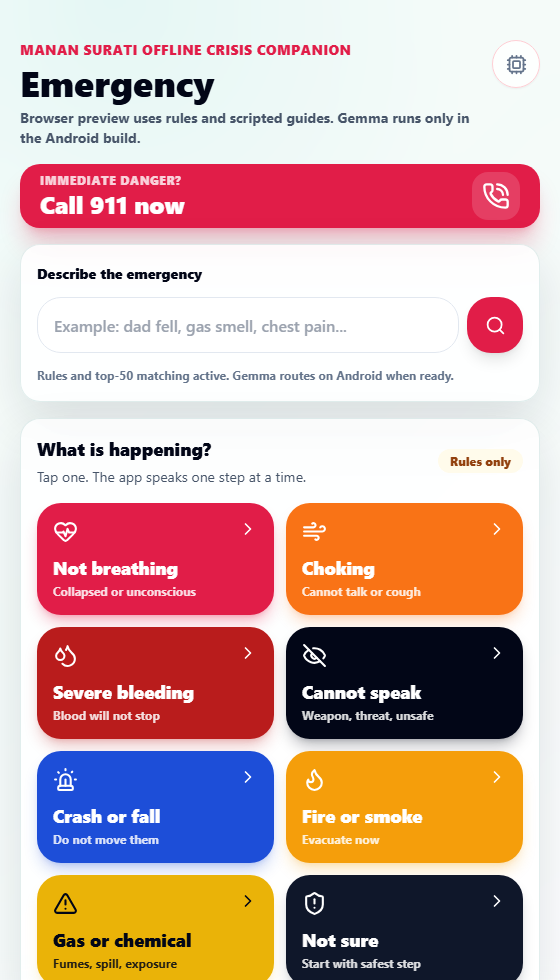
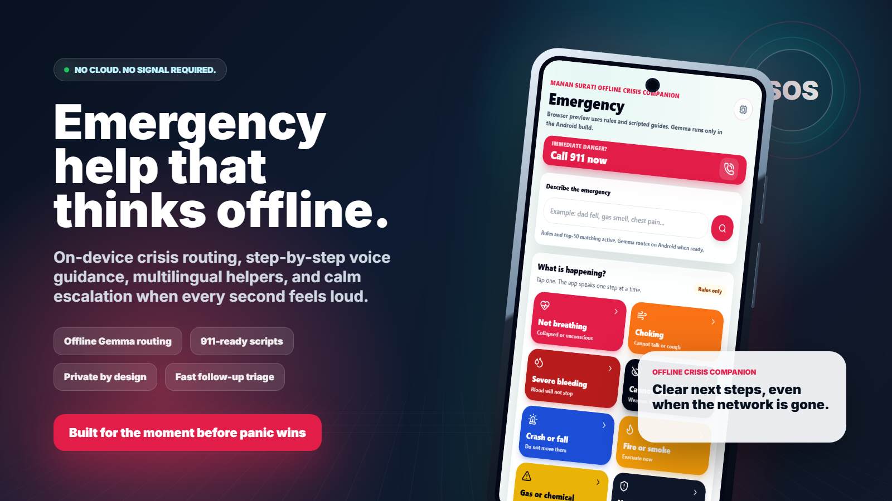
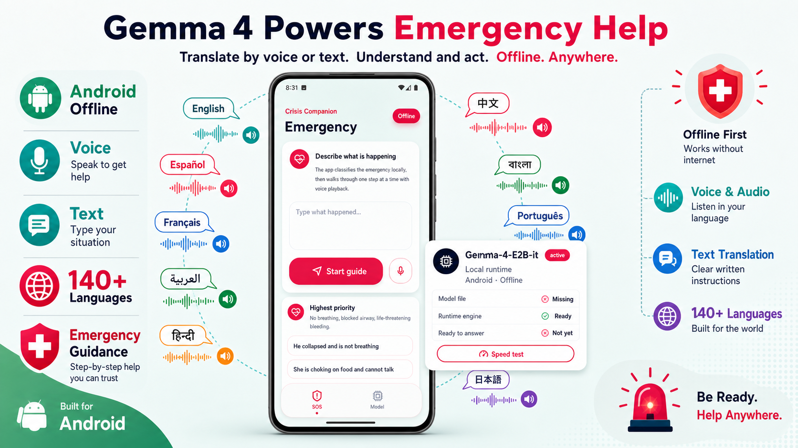

# Emergency Companion 🚨

Offline-first Android emergency guide and local AI companion built with React, Vite, Capacitor, and a native Android model bridge. Built for moments when the network is gone, the situation is loud, and the next step needs to be clear.

## Demo Video ▶️

Watch the app demo on YouTube: [Emergency Companion demo](https://www.youtube.com/watch?v=4w08K4KkezI)

## App Preview 📱



## Why It Helps 🧭



- 🚑 Emergency routing and step-by-step scripts
- 🔒 Private by design with on-device guidance
- 🗣️ Voice and text workflows for fast triage
- 🌍 Offline model setup for multilingual help

## Offline Gemma Help 🌍



## Install On Android ⚡

1. Download the APK from this repo:

   ```text
   Latest Emergency Companion.apk
   ```

2. Copy the APK to your Android phone.
3. Open the APK on the phone and allow installation from that file source if Android asks.
4. Launch **Manan Surati Offline Crisis Companion**.
5. Open the **Model** tab in the app to confirm whether the local model is found.

The app can still show built-in emergency guidance without the AI model. For local AI answers, add the model file below.

## Add The Offline Model 🧠

Do not put the model in GitHub. It is several GB and must be copied directly onto the phone.

Preferred model:

```text
gemma4_2b_v09_obfus_fix_all_modalities_thinking.litertlm
```

Phone path:

```text
/sdcard/Android/data/com.manan.offlineai/files/models/gemma4_2b_v09_obfus_fix_all_modalities_thinking.litertlm
```

Equivalent Android storage path:

```text
/storage/emulated/0/Android/data/com.manan.offlineai/files/models/gemma4_2b_v09_obfus_fix_all_modalities_thinking.litertlm
```

Recommended install from a Windows computer with Android Platform Tools installed:

```powershell
adb install -r ".\Latest Emergency Companion.apk"
.\scripts\install-litert-model.ps1 -ModelPath ".\gemma4_2b_v09_obfus_fix_all_modalities_thinking.litertlm"
```

Manual model copy is also fine. Create this folder on the phone:

```text
Android/data/com.manan.offlineai/files/models
```

Then copy `gemma4_2b_v09_obfus_fix_all_modalities_thinking.litertlm` into it.

## Speech Input 🎙️

The app does not bundle a Whisper, Vosk, or separate STT model. Speech input uses Android `SpeechRecognizer` with an offline preference. If voice input does not work offline, install the needed offline language pack in your phone's speech settings, then fully close and reopen the app.

## Build From Source 🛠️

Requirements:

- Node.js 20 or newer
- npm
- Android Studio or Android SDK command-line tools
- Android Platform Tools for `adb`

Build commands:

```powershell
npm install
npm run build
npx cap sync android
cd android
.\gradlew.bat assembleDebug
```

The debug APK is generated at:

```text
android/app/build/outputs/apk/debug/app-debug.apk
```

## Notes ✅

- Android package: `com.manan.offlineai`
- App name: `Manan Surati Offline Crisis Companion`
- The repo intentionally excludes `docs/`, generated outputs, Android build folders, and local model files.
- GGUF fallback support is present in the catalog, but the preferred phone setup is the LiteRT-LM `.litertlm` model above.
